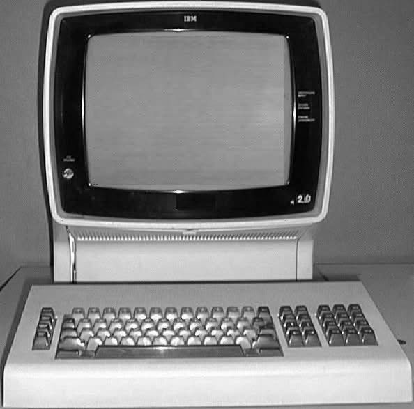

# O que é Pyx3270?

## :material-application-brackets-outline: Conceito
A Pyx3270 é uma biblioteca Python desenvolvida para automatizar a interação com emuladores 3270, facilitando tarefas repetitivas e complexas em ambientes mainframe. Ela atua como uma camada de automação, permitindo que você:

- Grave sessões reais e salve como arquivos

- Reproduza sessões offline para testes e simulações

- Envie comandos e colete dados de forma programada

Ela é construída sobre emuladores compatíveis com o protocolo 3270 (como s3270), e busca oferecer uma API intuitiva para automatizar operações normalmente feitas manualmente.

## :t_rex: O Universo dos Mainframes

Os mainframes são sistemas computacionais de grande porte que existem há décadas, especialmente em instituições financeiras, órgãos públicos e grandes corporações. Eles oferecem:

- Alta capacidade de processamento simultâneo

- Elevada confiabilidade e disponibilidade

- Suporte para milhares de usuários ao mesmo tempo

Apesar de sua robustez, muitos mainframes ainda operam com interfaces baseadas em terminal, utilizando o padrão 3270 — um protocolo que define como os dados são exibidos e interagidos via emuladores de tela (como x3270, s3270, entre outros).

{ width="350" }

Isso significa que muitas aplicações legadas são acessadas por meio de sessões de terminal com campos fixos, comandos de teclado e sem interface gráfica moderna.
